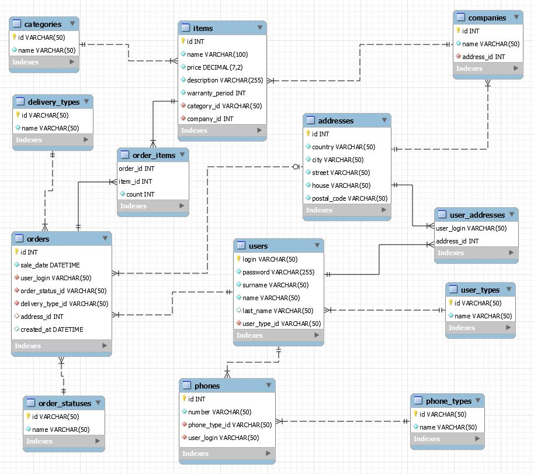

# База данных проекта

В качестве БД (базы данных) для проекта необходимо использовать РСУБД `MySQL` или
`PostgreSQL`. Может быть использована локальная база данных или работающая в Docker
(В зависимости от уровня сложности).
Для демонстрации работы проекта необходимо, чтобы БД содержала некоторые тестовые
данные (была предзаполнена).

*К сведению: во всех связях должно быть установлено каскадное обновление и удаление*

В проекте должна быть реализована схема интернет-магазина, торгующего комплектующими
для компьютеров.

При построении схемы были использованы следующие упрощения, что можно развивать:
- каждый товар находится только в одной категории;
- описание товара не разделено на различные подразделы;
- пароль пользователя хранится в незашифрованном виде;
- у каждого производителя только один адрес;
- в схеме нет реализации курьеров;
- не полноценная реализация адресов (корпус, штат, геолокация и т.д.);
- можно добавить различные триггеры (например, в заказе расчет суммы заказа)
- нет полноценного разделения на пользователей и администраторов;
- и т.д., так как этот список можно продолжать бесконечно.

## Схема данных

### Таблица `categories` - "категории товаров"

- id [`NOT NULL`, `VARCHAR(50)`, `PRIMARY KEY`] - уникальный идентификатор категории
- name [`NOT NULL`, `VARCHAR(50)`] - название категории

Вставить в таблицу следующие значения:

- GPU - Graphics Processing Unit
- CPU - Central Processing Unit
- MB - Motherboard
- RAM - Random Access Memory
- SSD - Solid-State Drive
- HDD - Hard Disk Drive
- CASE - Case
- POWER - Power Supply
- COOL - Cooling

### Таблица `items` - "товары"

- id [`NOT NULL`, `INT`, `AUTOINCREMENT`] - уникальный идентификатор товара
- name [`NOT NULL`, `VARCHAR(100)`] - название товара
- price [`NOT NULL`, `DECIMAL(7,2)`] - цена товара
- description [`NOT NULL`, `VARCHAR(255)`] - описание товара
- warranty_period [`NOT NULL`, `INT`] - гарантия (месяцев)
- category_id [`NOT NULL`, `VARCHAR(50)`, `REFERENCES categories(id)`] - категория товара

### Таблица `user_types` - "типы пользователей"

- id [`NOT NULL`, `VARCHAR(50)`, `PRIMARY KEY`] - уникальный идентификатор типа пользователя
- name [`NOT NULL`, `VARCHAR(50)`] - название типа пользователя

Вставить в таблицу следующие значения:

- ADMIN - Administrator
- USER - User

### Таблица `users` - "пользователи"

- id [`NOT NULL`, `VARCHAR(50)`, `PRIMARY KEY`] - уникальный идентификатор пользователя
- password [`NOT NULL`, `VARCHAR(255)`] - пароль пользователя
- surname [`NOT NULL`, `VARCHAR(50)`] - фамилия пользователя
- name [`NOT NULL`, `VARCHAR(50)`] - имя пользователя
- last_name [`VARCHAR(50)`] - отчество пользователя
- user_type_id [`NOT NULL`, `VARCHAR(50)`, `REFERENCES user_types(id)`] - тип пользователя

### Таблица `phone_types` - "типы номеров телефонов"

- id [`NOT NULL`, `VARCHAR(50)`, `PRIMARY KEY`] - уникальный идентификатор типа номера телефона
- name [`NOT NULL`, `VARCHAR(50)`] - название типа номера телефона

Вставить в таблицу следующие значения:

- WORK - Work phone number
- HOME - Home phone number
- MOBILE - Mobile phone number
- OTHER - Other phone number

### Таблица `phones` - "номера телефонов пользователей"

- id [`NOT NULL`, `INT`, `AUTOINCREMENT`] - уникальный идентификатор номера телефона
- number [`NOT NULL`, `VARCHAR(50)`] - номер телефона
- phone_type_id [`NOT NULL`, `VARCHAR(50)`, `REFERENCES phone_types(id)`] - тип номера телефона
- user_login [`NOT NULL`, `VARCHAR(50)`, `REFERENCES user(id)`] - пользователь с данным номером телефона

### Таблица `addresses` - "адреса"

- id [`NOT NULL`, `INT`, `AUTOINCREMENT`] - уникальный идентификатор адреса
- country [`NOT NULL`, `VARCHAR(50)`] - страна
- city [`NOT NULL`, `VARCHAR(50)`] - город
- street [`NOT NULL`, `VARCHAR(50)`] - улица
- house [`NOT NULL`, `VARCHAR(50)`] - дом
- postal_code [`NOT NULL`, `VARCHAR(50)`] - почтовый индекс

### Таблица `user_addresses` - "адреса пользователей или пользователи, которые живут по некоторому адресу"

*MM связь между `users` и `addresses`*

- user_login [`NOT NULL`, `VARCHAR(50)`, `REFERENCES users(login)`] - логин пользователя
- address_id [`NOT NULL`, `INT`, `REFERENCES addresses(id)`] - адрес

***

Полученная схема должна выглядеть следующим образом:

